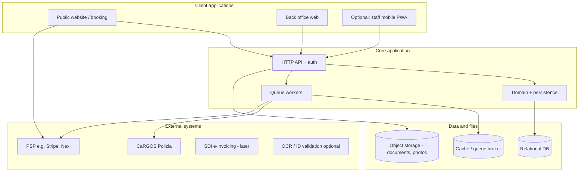

# Car rental management platform (Italy) — system structure and build plan

This document describes the **entire structure** of a self-drive car rental management system **oriented to Italy** (incl. **CaRGOS**), and a **phased, step-by-step** implementation order. It is a technical blueprint, not legal advice. Confirm contracts, **CaRGOS** field rules, and fiscal obligations with **qualified Italian counsel and your accountant**.

**Selected implementation stack (all TypeScript):** [docs/TECH_STACK.md](docs/TECH_STACK.md) · **Structural map of the current monorepo** (modules, data spine, routes): [docs/STRUCTURE.md](docs/STRUCTURE.md).

---

## 1. Scope

The platform should:

- Sell and manage **short- and long-term** self-drive rental.
- Run **branch operations** (calendar, handover, return, damage, deposits).
- Support **Italian** requirements: **contracts**, **privacy (GDPR)**, **CaRGOS** (where applicable), **payments (PSD2)**, and when ready **e-invoicing / SDI** (Agenzia delle Entrate).
- Support **multiple vehicle types** (cars, scooters, vans, etc.) via **configuration**, not ad-hoc code.

---

## 2. High-level architecture

**Recommendation:** start with a **modular monolith** (one deployable service, clear internal modules) plus **background workers** (queue). Split into separate services only when you have a concrete operational or scale need.

### 2.1 Application surfaces

| Surface | Users | Role |
|--------|--------|------|
| **Public web** | Customers | Search, book, pay, self-service, upload documents, sign contract. |
| **Back office** | Counter, fleet, admin | Calendar, check-in/out, damage, fees, customers, **CaRGOS** status, overrides (with audit). |
| **Optional PWA** | Field staff | Pickup/return, photos at vehicle, tablet-friendly. |

---

## 3. Core domains (modules)

Implement each area as a **module** (bounded context): explicit APIs between modules, no “god” service.

### 3.1 Organization and access

- **Company / legal entity** (invoicing, **CaRGOS** enrollment, VAT, PEC if required).
- **Stations (locations)**: address, hours, `Europe/Rome` timezone, optional capacity.
- **Users and roles** (examples): `admin`, `branch_manager`, `agent`, `readonly_accounting`.
- **Audit log**: tariff changes, calendar overrides, **handover** without **CaRGOS** (only with **supervisor** + **mandatory reason**).

### 3.2 Fleet and catalog

- **Vehicle** (physical unit): VIN, plate, `vehicle_type` (car, scooter, van…), class, odometer, fuel, `station_id` (current or home).
- **Status**: e.g. `available`, `rented`, `maintenance`, `out_of_fleet`, `transit`.
- **Non-rentable**: maintenance, or **calendar block** (see §3.3).
- **Rate plans and extras**: daily/weekly/monthly, **seasons**, one-way matrix, **cross-border** add-ons, young driver, additional driver, equipment, **insurance** product tiers (commercial names mapped to your legal coverage terms).

### 3.3 Reservations and calendar (inventory engine)

- **Reservation**: customer, `vehicle` and/or `vehicle_class`, pickup/return **station** and **datetimes**, status (`quote`, `pending_payment`, `confirmed`, `no_show`, `in_progress`, `completed`, `cancelled`).
- **Inventory engine** (critical):
  - **Assigned vehicle:** timeline must be free of overlapping **reservations** and **maintenance/buffer** blocks.
  - **“Or similar” by class:** count available units in the class in the requested window.
- **Pricing engine:** duration, km package, line-item extras, **VAT** display, deposit rules.

**“Occupied / vacant”** in the UI is derived: a unit is **vacant** for a new booking if and only if the engine says it is free in `[pickup, return)`.

### 3.4 Customers and KYC

- **Person or company** profile, addresses, Italian **fiscal** fields when you need them for invoicing (VAT, **Codice fiscale**, **SDI** code for B2B).
- **Documents:** ID, driving licence; object storage, **retention** policy, access logging.
- **Optional AI/OCR:** upload → async job → **extracted fields** → **staff confirmation**; define policy for **no handover** on failed verification.
- **Privacy:** consents, processing purposes, DPA with subprocessors, optional **DPO** contact in settings.

### 3.5 Contracts and e-sign (CaRGOS trigger)

- **Template versioning** (T&Cs and rental agreement — lawyer-reviewed).
- **Contract instance:** snapshot of template version, parties, line items, **signatures** (click-wrap + IP/timestamp, or **qualified** e-sign if you invest in that level).
- **State machine (conceptual):**  
  `draft` → `awaiting_sign` → `signed` → **enqueue CaRGOS** (Italy, in scope) → `ready_for_handover` (only when all configured gates pass).

### 3.6 CaRGOS and Italian police communication (in scope)

**CaRGOS** = **C**ar **R**enter **G**uardian **O**peration **S**ystem — [Polizia di Stato](https://cargos.poliziadistato.it/Cargos_Portale/). Operators of **self-drive** rental in scope must transmit **ID-related data** of the person requesting the vehicle, **in connection with** the contract, **in good time** before handover, per the **D.L. 4 October 2018 n. 113** (art. 17) and **D.M. 29 October 2021** (technical modalities). Exclusions in law include some **carsharing / shared mobility** models — model this as **product/station** settings, **not** a single global flag.

- **Onboarding (operational, not in app code alone):** enrollment with the **Questura** for the **legal seat**; **PEC**-based documentation as required; **credentials** from Polizia; multi-branch: often **one** set of **credentials** and **central** transmission for branches.
- **In the application:**
  - **Settings:** which **legal entity**, **excluded** product types, **branch** → entity mapping, **cutoff** relative to handover, **test vs production** (if the platform offers it).
  - **Records:** one row per **submission** with request/response payload references, **status**, **retries**, **idempotency** key per **rental contract id**.
  - **Handover gate:** **block “keys released”** in workflow until **CaRGOS** = success (or **formal** manual exception: **signed** + **audited** reason, only for roles you define).
- **Implementation:** use the **official** portale, manuals, and **codifiche**; **PEC/email** is **not** the default channel; some **Questure** describe **CSV fallback** only if the **platform** is down — follow **current** D.M. and local instructions.
- **Integration style:** if no stable public **REST API** is published for you, the practical options are (a) **web portale** + controlled automation, (b) vendor middleware — **re-verify** with Polizia documentation at build time.

### 3.7 Payments and billing (Italy)

- **PSD2 / SCA** for online card flows; **preauthorization** for damage deposit; **capture** on fees or on schedule.
- **Reconciliation** between PSP webhooks, **reservation id**, and **return closure**.
- **Fiscal side:** when you are ready, **invoices** / **receipts** according to your regime; **B2B** will need **SDI**-ready fields — design **Customer** and **Invoice** **early** to avoid refactors (implementation of SDI can be a later **phase**).

### 3.8 Check-in, check-out, damage

- **Check-in/out** checklists: fuel, odometer, **in/out** photos.
- **Damage** cases: photos, line items, link to **deposit capture** and insurance flags.

### 3.9 Maintenance

- **Service** intervals, **odometer** triggers, **blocks** on the same calendar that drives availability.

### 3.10 Reporting

- **Utilization**, **revenue** by channel, **CaRGOS** success/failure, **reconciliation** exports for accounting (CSV, etc.).

### 3.11 Integrations layer

- Adapters: `CaRGOSClient`, `PaymentProvider`, `OcrProvider`, `SdiClient` (stub until live). **No** direct HTTP in domain **entities** — keep in **infrastructure** adapters.

### 3.12 Partner API (B2B / OTA)

- **Partner API keys** per company: scoped access to availability, quotes, and reservation lifecycle (see [docs/CODEBASE.md](docs/CODEBASE.md) · `PARTNER`).
- **Outbound webhooks:** when a partner registers a `webhookUrl`, enqueue **signed** delivery attempts (`PartnerWebhookDelivery`) with worker-driven retry/backoff and desk visibility; ops use [docs/STRUCTURE.md](docs/STRUCTURE.md) (G2 **async** row) and health/metrics for queue depth.
- **Beyond current scope:** OAuth/mTLS, partner self-service portal, formal SLA tooling — treat as later hardening unless product requires them.

---

## 4. Suggested data entities (spine)

Relational design around **reservation** and **vehicle** (or **class** for “or similar”):

- `companies`, `stations`, `users`, `roles`, `audit_log`
- `vehicles`, `vehicle_classes`, `rate_plans`, `extras`, `seasons` (or equivalent)
- `reservations`, `reservation_lines`, `payment_intents`, `deposits`
- `customers`, `customer_documents`, `consents`
- `rental_agreements`, `agreement_template_versions`, `signatures`
- `cargos_submissions` (or `italy_police_rental_notifications`) — full audit
- `calendar_blocks` (maintenance)
- `invoices`, `invoice_lines` (when fiscal module is on)
- `partner_api_keys`, `partner_webhook_deliveries` (B2B integrations; outbound notification audit)

---

## 5. Security and operations

- **Back office:** strong passwords, **2FA** for `admin` / `branch_manager` at minimum.
- **Encryption:** TLS; **at-rest** for documents; **backup** and **restore** tested.
- **Environments:** `dev`, `staging` (fake payments, no **production** **CaRGOS**), `prod`.
- **GDPR:** retention schedules, data subject request process, **subprocessor** list.

---

## 6. Build order (phased, vertical slices)

Build so each phase has an **end-to-end demo**. Order avoids paying before you can rent, or **CaRGOS** before a **signed contract** exists.

### Phase 0 — Foundation

- Repo, **CI**, linters, **migrations**, **one** target deploy (e.g. Docker).
- **Auth** (back office) + first **role** + **audit** for critical actions.
- **Object storage** (one file type to prove the pipeline).
- **Exit:** health check, **stations** CRUD, deployable artifact.

### Phase 1 — Fleet and calendar (internal)

- **Companies, stations, vehicles, classes.**
- **Calendar blocks** (maintenance) on **vehicles**.
- **Availability query** for a **vehicle** in `[A, B)` (no pricing yet).
- **Exit:** back office shows **free / reserved / maintenance** on a **calendar** or list.

### Phase 2 — Reservations (back office only)

- Create / edit / cancel **reservation**; assign **vehicle** (start **specific-vehicle** only if simpler).
- **Conflict** detection; optional **overbooking** rules per class (later).
- **Minimal customer** (name, email, phone).
- **Exit:** one **reservation** blocks **vehicle**; calendar shows **rental** as occupied.

### Phase 3 — Public booking (limited)

- **Public** search by **dates / station / class**; **simple** or **static** price at first; **basket** with extras.
- **Create reservation** + **email** confirmation; optional “**pay in branch**” to defer payments.
- **Exit:** customer booking appears in back office with **end-to-end** path.

### Phase 4 — Contract + document upload

- **Agreement** templates + version; **customer** **signs**; store **signed** **snapshot** + **audit** trail.
- **Upload** **ID** / **licence**; **staff** **verification** flag (manual at first).
- **Gate in UI:** handover not allowed until **signed** + **verified** (per your policy).
- **Exit:** one **compliance** bundle per **rental** in storage + DB.

### Phase 5 — CaRGOS (Italy)

- **Settings** and **adapter**; **async** **worker**; **idempotent** **submissions**; **dashboard** and **alerts** on failure.
- **Enforce** **handover** **workflow** to match **D.M.** **timing** (and counsel).
- **Exit:** for in-scope **Italy** **rentals**, **CaRGOS** **success** is part of the **default** handover path.

### Phase 6 — Payments (PSP)

- **Test** mode: **SCA** **payment**; **preauth** **deposit**; **webhooks**; **reconciliation**; **return**-time **capture** / **refund** rules.
- **Exit:** **staging** with **realistic** **money** **flow** (test cards).

### Phase 7 — Check-in / out and damage (operations)

- **Handover** and **return** wizards, **odometer** / **fuel** / **photos**; **damage** → **line** **items** → **capture** from **deposit**.
- **Exit:** **counter** can run a **day** off **spreadsheets**.

### Phase 8 — Italian fiscal (when the business is ready)

- **Invoice** entity, **line** **items**, **VAT**; **SDI** **adapter** in line with your **regime** and **accountant**.
- **Note:** you can add **fiscal** **fields** to **Customer** in **Phase 0–2** and **turn on** **SDI** in this phase.

### Phase 9 — Hardening and growth

- **Dynamic** **pricing** (seasons, **min** **stay**), **one-way** **fees** matrix, **API** for **partners**, **observability** (metrics, **alerts** on **CaRGOS** **error** **rate**), **security** **review**, **DPA** **pack** and **Garante**-aligned **privacy** **docs** with counsel.

---

## 7. Key flows (summary)

1. **Book** → public or staff creates **reservation** (+ **optional** **payment**).
2. **Prepare** → **agreement** **signed**; **docs** **uploaded**; **staff** **verify**.
3. **Italy compliance** → **signed** **contract** triggers **CaRGOS** (if in scope) → **success** before **default** handover.
4. **Handover** → **photos** / **odometer** → `in_progress`.
5. **Return** → **fees** → **capture** or **refund** **deposit**; **close** **reservation** (then **fiscal** **document** if your process requires it on close).

---

## 8. References (official / structural — verify at build time)

- [CaRGOS portale - Polizia di Stato](https://cargos.poliziadistato.it/Cargos_Portale/)
- [EU cross-border road traffic information (context, not a substitute for CaRGOS)](https://transport.ec.europa.eu/)  
- [TopRent (example Baltic operator — different **police** rules from Italy](https://toprent.com/)

---

## 9. Document history

- **2026-04-24** — Initial consolidation from architecture and phased plan for **Italy** + **CaRGOS** context; canonical path `ARCHITECTURE.md`.
- **2026-04-24** — Linked **selected** TypeScript stack; canonical path [docs/TECH_STACK.md](docs/TECH_STACK.md) (moved from repo root).
- **2026-05-06** — **Partner API (G2):** outbound webhooks, delivery queue/worker, desk log — see §3.12 and spine rows `partner_api_keys` / `partner_webhook_deliveries`; detail in [docs/STRUCTURE.md](docs/STRUCTURE.md).

---

*This file is a living technical outline: update it when you lock stack choices, CaRGOS integration method, and fiscal regime.*
