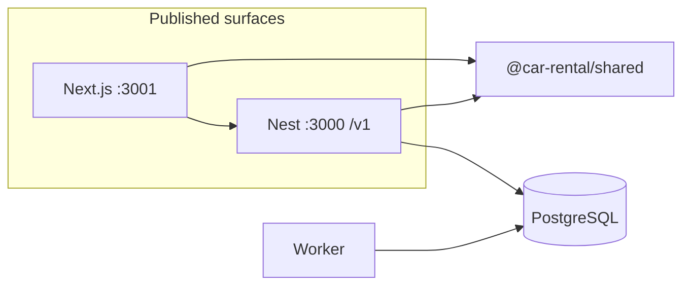
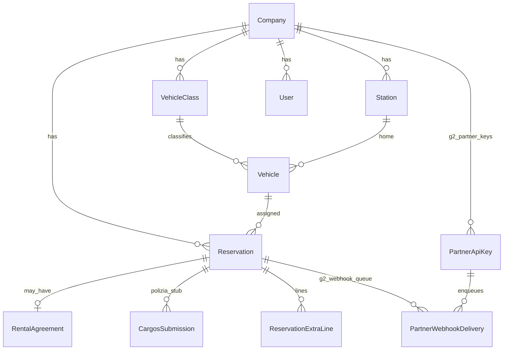

# Main structures (this repository)

This document is the **structural map of the code as built**: packages, runtimes, API modules, and data spine. The product vision and phased roadmap live in [ARCHITECTURE.md](../ARCHITECTURE.md). Implementation details and route lists live in [CODEBASE.md](CODEBASE.md).

## 1. Monorepo

| Layer | Path | Role |
|-------|------|------|
| **Shared contracts** | `packages/shared` | Zod schemas, `API_VERSION`, rental-day / pricing math — **imported by** `apps/api` and `apps/web` (TypeScript, built with `tsc`) |
| **API** | `apps/api` | NestJS **v1** HTTP service; Prisma + PostgreSQL; **global** `JwtAuthGuard` + Throttler; `@Public()` for unauthenticated routes |
| **Web** | `apps/web` | Next.js **App Router** — public `/` + `/quote`; staff auth + `/desk/**` back office |
| **Worker** | `apps/worker` | Node process, same Prisma client **schema** as API (`../api/prisma`); **CaRGOS** stub — **DB poll** (no BullMQ/Redis in v1); **B2** retention purge; optional **`fetch`** to API **`POST /v1/internal/cron/*`** (C2 / F3 / G3 / **G2** partner webhooks) when **`WORKER_INTERNAL_SECRET`** + interval envs are set |
| **Deploy** | `deploy/` | Dockerfiles + example compose; see [PRODUCTION.md](PRODUCTION.md) |

**Dependency rule:** `web` and `api` depend on `shared`. `worker` does not import `shared` today; it uses `@prisma/client` from API’s Prisma generate path.

## 2. API (`apps/api/src`) — Nest modules

`AppModule` wires global **Config** (with `validateEnv`), **Throttler**, **Prisma**, **Mail** (optional SMTP), then feature modules. **Default:** every route requires **Bearer JWT** unless a handler or controller is marked `@Public()`.

| Module / area | Path | Responsibility |
|---------------|------|-----------------|
| **Auth** | `auth/` | Login, register (optional), JWT strategy, `RolesGuard`, **company/branch** access in `auth/company-access.ts` |
| **Organization** | `organization/` | Companies, stations, **customers** (CRUD + **customer KYC documents**, same object storage as agreements) |
| **Fleet** | `fleet/` | Vehicle classes, vehicles, calendar blocks, **availability** |
| **Pricing** | `pricing/` | `GET /rates/quote` — reuses `sumClassRentCents24h` from shared |
| **Reservations** | `reservation/` | Reservations CRUD, **source** (`STAFF` / `PUBLIC_WEB` / **`PARTNER`**), odometer, **summary**; audit hooks on key mutations |
| **Payments** | `payments/` | Stripe Checkout, deposit hold, webhooks, refunds (optional) |
| **Rental agreement** | `rental-agreement/` | Agreement CRUD, attachments (local or S3) |
| **CaRGOS integration** | `integrations/cargos/` | Enqueue + list **submissions**; real transmission is the **worker** |
| **Partner (G2)** | `partner/` | B2B **`PartnerApiKey`**, **`PartnerKeyGuard`** — **`POST/GET /partner/reservations`**; company-scoped keys + webhook on **`CompanyPartnerApiKeysController`**; **`PartnerWebhookService`** + **`PartnerWebhookModule`** |
| **Internal** | `internal/` | **`POST /internal/cron/*`** (Bearer **`WORKER_INTERNAL_SECRET`**) — rent reminders, service-due blocks, customer-document OCR, partner webhook deliveries |
| **Public** | `public/` | `GET/POST` **no JWT** — catalog, quote, availability, `quote-reservations` (throttled) |
| **Mail** | `mail/` | Global **optional SMTP** (`nodemailer`) — e.g. public quote **saved** acknowledgement when `SMTP_*` is set |
| **Health** | `health/` | `/health`, `/health/ready` (used by load balancers) |
| **Audit** | `audit/` | `AuditController` at root; `AuditService` used across modules |

Cross-cutting: **`PrismaService`**, **audit** `log`, **availability** in fleet layer.

## 3. Data spine (Prisma)

Single PostgreSQL database. Core relationships (simplified):

**Authoritative rules** for inventory overlap and status filtering: half-open intervals — see `apps/api/src/fleet/intervals.ts` and `reservationNonBlockingStatusValues` in shared.

## 4. Web app routes (`apps/web/app`)

| Area | Route pattern | Access |
|------|----------------|--------|
| Marketing / entry | `/` | Public |
| Public quote | `/quote` | Public — calls `NEXT_PUBLIC_API_URL` **without** token |
| Renter hub (stub) | `/my` | Public — entry points for quote / booking view / staff sign-in (full renter portal TBD) |
| Login | `/auth` | Public — stores JWT, redirects to `next` or desk (`/login` redirects to `/auth`) |
| Back office | `/desk`, `/desk/organization`, `/desk/fleet`, `/desk/customers`, `/desk/reservations`, `/desk/team`, `/desk/audit` | **Client** layout (`DeskLayout`) requires token; uses **Bearer** `apiJson` to API |

`DeskNav` and desk pages are **not** a second backend — all business logic stays in the API.

## 5. Asynchronous / background work

| Process | Trigger | Data path |
|---------|---------|------------|
| **Worker** | Poll loop | Picks `CargosSubmission` `PENDING` → `MOCK_SENT` / `FAILED`; env in `apps/worker` README / CODEBASE |
| **G2 partner webhooks** | API `POST /internal/cron/partner-webhook-deliveries` (Bearer **`WORKER_INTERNAL_SECRET`**) or worker idle tick when **`WORKER_PARTNER_WEBHOOK_INTERVAL_MS` > 0 | `PartnerWebhookDelivery` **PENDING** → HTTPS POST → **SUCCEEDED** / retry **PENDING** / **DEAD** |

**No Redis/bull in v1** for CaRGOS; the worker is a single-process DB poller. Redis in `docker-compose` is for optional future use or cache.

## 6. How this relates to ARCHITECTURE.md

[ARCHITECTURE.md](../ARCHITECTURE.md) describes the **target** platform (multi-surface, SDI, real CaRGOS, queue workers, etc.). **This repo** implements a **modular monolith** API plus one worker stub and a thin Next client — the tables above are what exists **today**, not the full future diagram in §2 of ARCHITECTURE.

## 7. Dealers, branding, and renter “my area” (operations + roadmap)

**Data isolation:** Fleet, stations, customers, and reservations are keyed by **`companyId`** in Prisma — dealers do not share vehicle rows. The **staff desk** (`/desk/**`) is one Next.js app; access is enforced in the API via JWT **`companyId`**, **`RolesGuard`**, and helpers in `apps/api/src/auth/company-access.ts` (including **`AGENT` + `stationId`** scoping on some lists and reservations).

**So dealers “never see each other” in production:**

- Prefer **one company per staff user** (each user’s `companyId` matches only their dealer).
- Reserve **`ADMIN`** for trusted operators who genuinely need cross-company access; otherwise they can switch company context in the desk where the product allows it.
- Use **`AGENT`** with an assigned **`stationId`** for branch-only workflows where those rules already apply.
- Set API **`ENFORCE_STAFF_SINGLE_COMPANY=true`** so even **`ADMIN`** JWTs are **company-bound** (no `assertSameCompany` bypass, `GET /companies` only returns their dealer, list filters cannot span tenants). `GET /auth/me` includes **`adminCrossCompanyAccess`** for the desk.

**Per-dealer branded site / URL:** Not implied by the code alone. Treat as **deployment / white-label**: separate hostnames, env (e.g. `NEXT_PUBLIC_API_URL`, public branding), or **separate deployments** per dealer against the same or split databases — see [PRODUCTION.md](PRODUCTION.md) for runtime configuration.

**Renter “my area” (customer portal):** Today, renters mainly use **public** flows (`/`, `/quote`, booking links). A logged-in **“my bookings / documents / invoices”** surface would be a **new module** in `apps/web` (routes + auth story) calling **existing v1 APIs** where possible; it is **not** the same product surface as `/desk/**`. A minimal **public hub** exists at **`/my`** (links into quote, booking view, and staff sign-in — placeholder until renter auth ships).

---

For env variables, health checks, and Docker, see [PRODUCTION.md](PRODUCTION.md).
